# Technical Documentation: FIFO Queue Snake Implementation

## 1. Summary

This project teaches students how a queue data structure can be used in a real program.

Students must implement a **singly linked queue** that controls the movement of a Snake game. The graphical part of the game is already built using **Raylib**. Students only implement the queue and provide the API required by the game engine.

---

## 2. Data Structure Overview

The implementation uses two structures:

* **`node_t`**
  Represents one element in the queue.

  Each node contains:

  * a `cell_t` structure (stores the segment position and color)
  * a pointer to the next node

* **`queue_t`**
  Represents the queue itself.

  It contains:

  * a pointer to the `head` (oldest element)
  * a pointer to the `tail` (newest element)
  * a length counter

The length counter allows the queue size to be checked in constant time: $O(1)$.

---

## 2.1 Queue Initialization

At the start, the queue is empty.

Both `head` and `tail` are set to `NULL`.

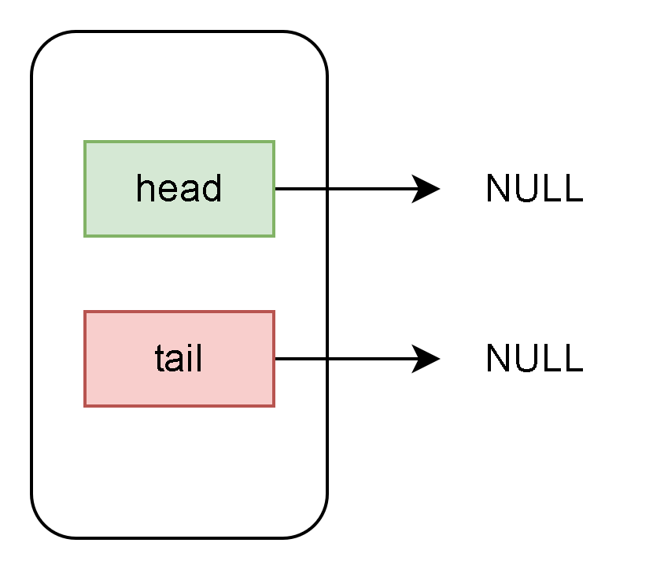

When the first element is added:

* `head` points to the new node
* `tail` also points to the same node

This is an important edge case because the queue contains only one element.

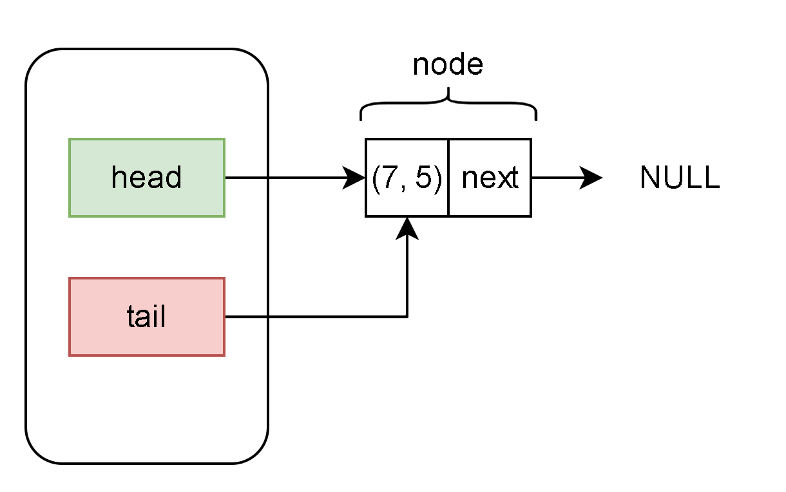

When another element is added:

* `tail->next` points to the new node
* `tail` is updated to the new node

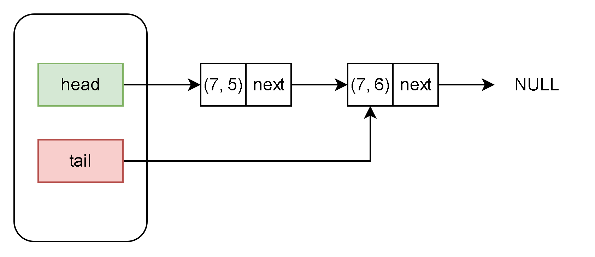

When removing an element:

* `head` moves to the next node
* the old node is freed from memory

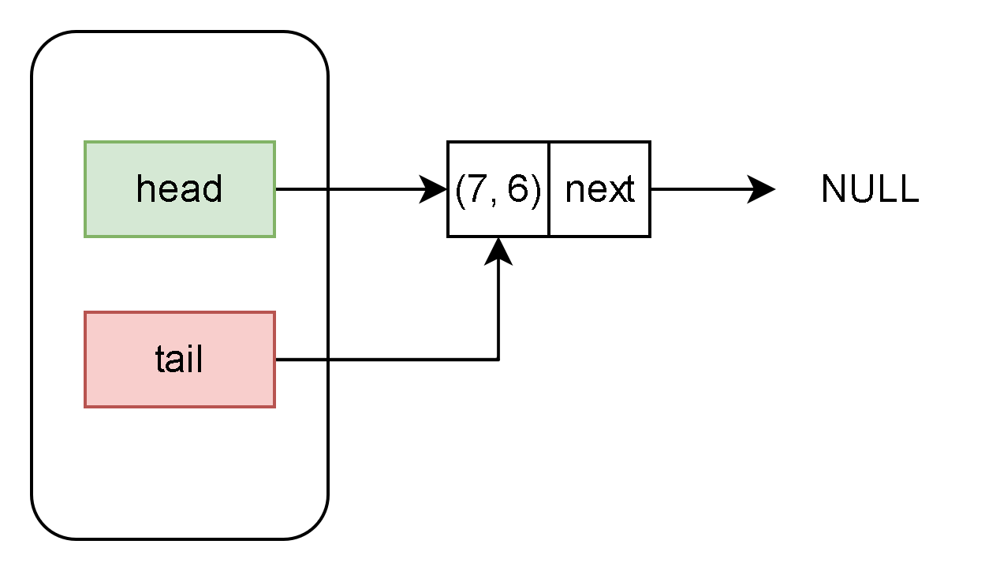

---

## 3. FIFO Movement Model

The snake moves by repeatedly:

1. adding a new position
2. removing the oldest position

This follows the **FIFO (First In, First Out)** behavior of a queue.

The snake head corresponds to the queue tail.

The snake tail corresponds to the queue head.

---

## 3.1 Normal Movement (Add and Remove)

During a normal game update:

1. `queue_add()` adds a new segment position to the queue tail
2. `queue_remove()` removes the segment at the queue head

The snake keeps the same length, but its position changes. This creates the appearance of movement.

### Original Position

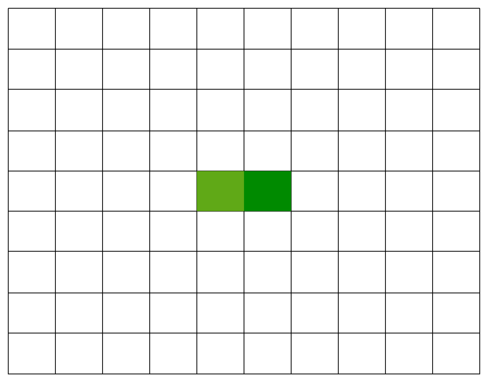

### Adding a New Segment (`queue_add()`)

A new segment is added at the snake head.

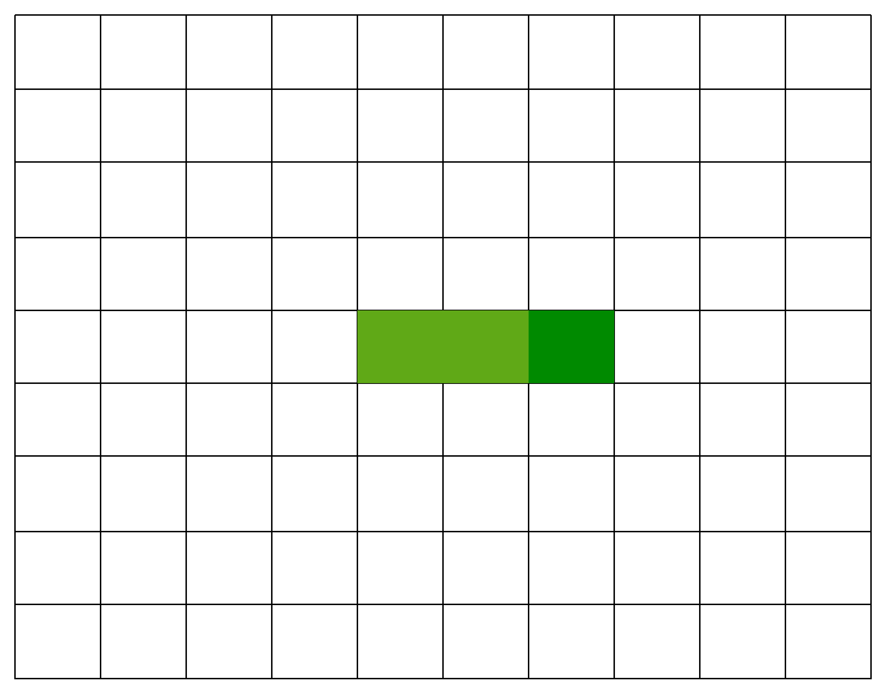

### Removing the Tail Segment (`queue_remove()`)

The oldest segment is removed from the snake tail.

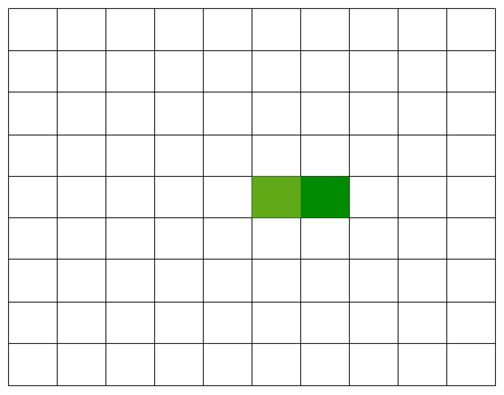

The snake has now moved forward by one tile.

---

## 3.2 Snake Growth (Add Only)

When the snake eats food:

* a new segment is added
* the removal step is skipped for one update

Because no segment is removed, the queue length increases and the snake grows.

### Snake Approaching the Apple

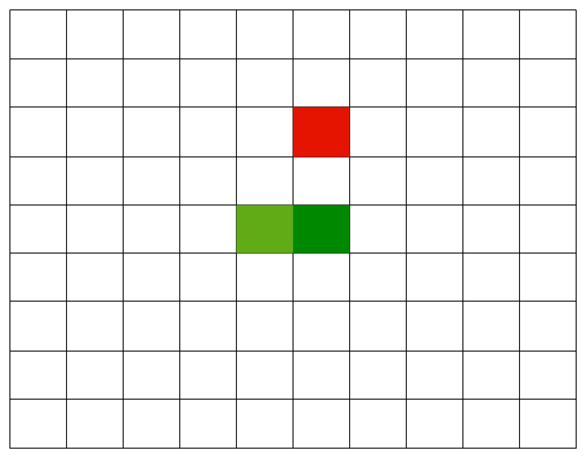

### Snake Moving Closer

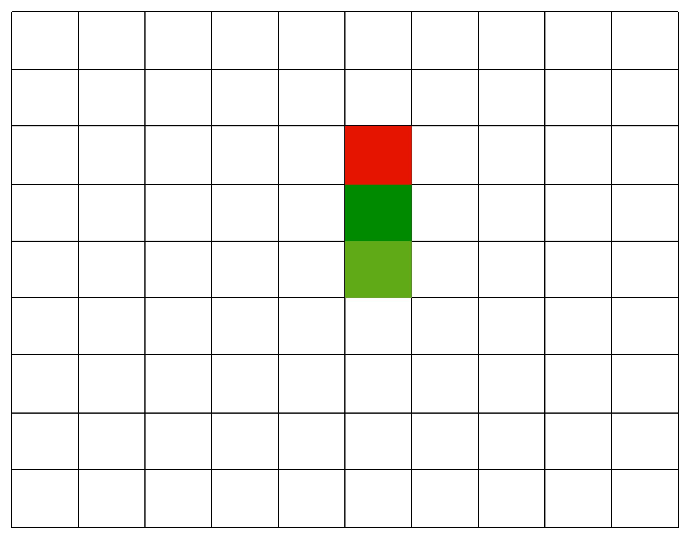

### Snake Eats the Apple

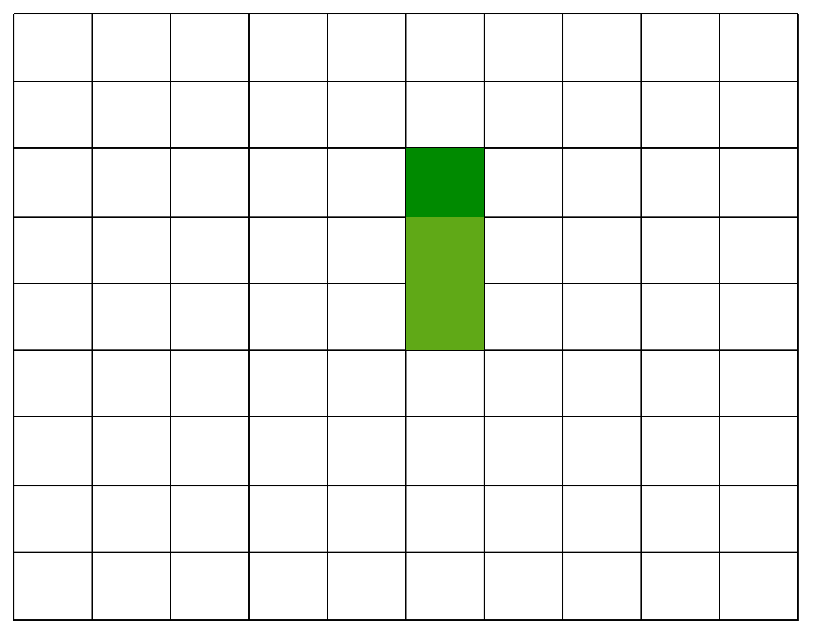

### Tail Segment Is Not Removed

Normally the tail segment would be removed.
Here it remains in place, causing the snake to grow.

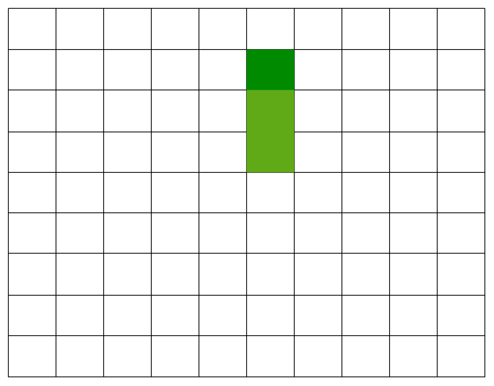

---

## 4. Technical Constraints and Learning Goals

This project focuses on important C programming concepts.

---

## 4.1 Pointer Management

Students must correctly update pointers when:

* adding a node
* removing a node

Examples:

* updating `tail->next`
* moving the `head` pointer during removal

---

## 4.2 Memory Safety

Students are responsible for allocating and freeing memory correctly.

During removal, the recommended order is:

1. save the node pointer
2. update the queue pointers
3. free the old node

Incorrect ordering can cause:

* dangling pointers
* use-after-free bugs
* segmentation faults

---

## 4.3 Encapsulation

The game engine only communicates with the queue through the provided header file.

Students should not directly modify the game state outside the queue API.

---

## 5. Testing

The project includes a `queue_print()` function for debugging.

Students can use it to verify queue behavior before running the graphical game.

---

## 5.1 Correct Behavior

A correct implementation should:

* move the snake correctly
* grow the snake correctly
* wrap around the screen properly
* avoid memory leaks

---

## 5.2 Common Failure

A common error is a segmentation fault during `queue_remove()`.

This is usually caused by:

* incorrect `NULL` checks
* freeing memory too early
* incorrect pointer updates
